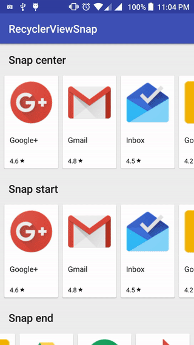

# RecyclerViewSnap

RecyclerView snapping example with SnapHelper

</img>   </img>

## How to

If you need snapping support to start, top, end or bottom, use GravitySnapHelper.

Add this to your build.gradle:

```groovy
compile 'com.github.rubensousa:gravitysnaphelper:0.3'
```

Otherwise, center snapping is done with LinearSnapHelper (part of the recyclerview-v7 package).

### Snapping center:

```java
SnapHelper snapHelper = new LinearSnapHelper();
snapHelper.attachToRecyclerView(recyclerView);
```

### Snapping start with GravitySnapHelper:

```java
startRecyclerView.setLayoutManager(new LinearLayoutManager(this,
                LinearLayoutManager.HORIZONTAL, false));
                
SnapHelper snapHelperStart = new GravitySnapHelper(Gravity.START);
snapHelperStart.attachToRecyclerView(startRecyclerView);
```

### Snapping top with GravitySnapHelper:

```java
topRecyclerView.setLayoutManager(new LinearLayoutManager(this));
                
SnapHelper snapHelperTop = new GravitySnapHelper(Gravity.TOP);
snapHelperTop.attachToRecyclerView(topRecyclerView);
```
